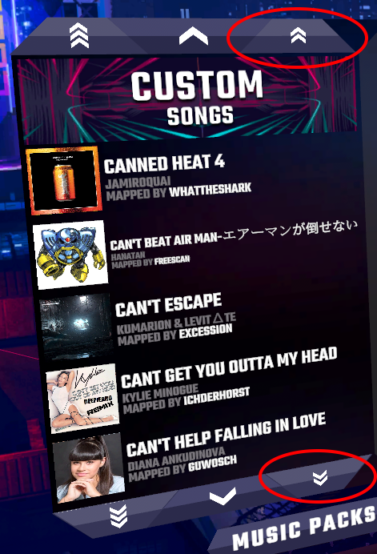

# SRFastScrollButtons

Adds new scroll buttons for faster song navigation in Synth Riders [PCVR]

The middle arrow buttons also scroll instantly one page at a time, so the scroll animation no longer glitches out if you spam those buttons.

*Note the original Top/Bottom buttons now have an additional arrow/echelon to indicate that they scroll the farthest

## Setup
1. Install MelonLoader if you don't already have it:  https://wiki.synthriderz.com/en/guides/installing-mods
2. Grab the newest version of SRFastScrollButtons from releases and extract it to your game directory under .../SynthRiders/Mods (create Mods directory if necessary)
3. [Jam out with Strong Bad!](https://homestarrunner.com/assets/sbemails/sounds/scrollsong3_10.mp3)

## Known Issues
* Functional: Scrolling with thumbsticks seem to not be working correctly.  Rely on the arrows for now.
* Cosmetic: Scrolling with the controller thumbstick always gives animation appearance that the list is scrolling down, even if it's actually scrolling up.
* Cosmetic: At the very top or bottom of the song list, the appropriate buttons do not become disabled.

## Disclaimer
This mod is not related to Synth Riders Devs or Kluge Interactive or The Brothers Chaps.
